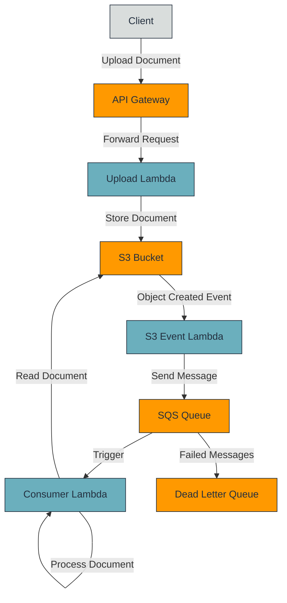

# Document Processor Architecture

## Architecture Diagram

## Component Details

### API Gateway
- Handles HTTP requests for document uploads
- Supports multipart/form-data for file uploads

### Upload Lambda
- Processes upload requests
- Stores documents in S3 bucket
- Returns upload confirmation to client

### S3 Bucket
- Stores uploaded documents
- Triggers events on document creation

### S3 Event Lambda
- Triggered by S3 ObjectCreated events
- Creates ingestion tasks
- Sends messages to SQS queue

### SQS Queue
- Decouples document ingestion from processing
- Provides buffering and retry capabilities
- Routes failed messages to Dead Letter Queue

### Consumer Lambda
- Processes documents from the queue
- Reads documents from S3
- Implements document processing logic

### Dead Letter Queue
- Stores failed messages for debugging
- Allows manual reprocessing of failed messages 